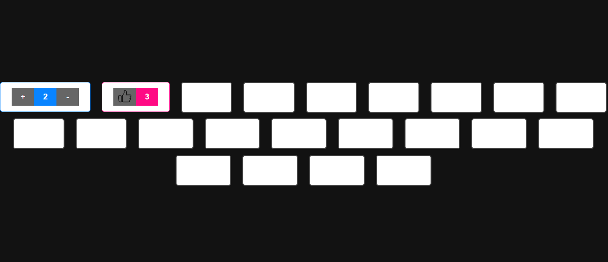
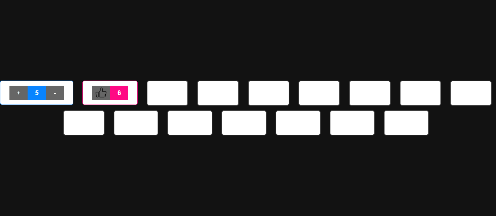
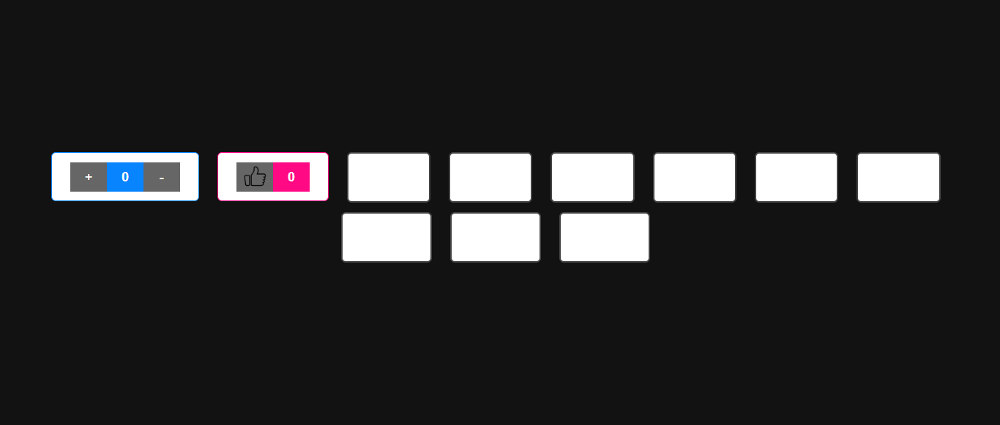

# BOTOES COM JQUERY
👨‍🏫INTERFACE COM 20 BOTÕES E DIVERSOS EFEITOS DO JQUERY.

  
  
  

## DESCRIÇÃO:
Este projeto demonstra a utilização de jQuery para adicionar interatividade a uma série de botões em uma página web com um tema escuro. Ele inclui um contêiner centralizado com 20 botões, cada um com diferentes efeitos que são acionados ao clicar, utilizando as funções de animação e manipulação de jQuery.

- **Botões de Contador**: Aumenta e diminui o contador ao clicar nos botões de mais e menos.
- **Botão de Like (Thumbs Up)**: Incrementa o contador de likes ao clicar.
- **Botões de Efeitos**: Cada um dos 18 botões adicionais demonstra um efeito diferente disponível no jQuery, como fade, slide, shake, bounce, etc.

## NÃO SABE?
- Entendemos que para manipular arquivos em `HTML`, `CSS` e outras linguagens relacionadas, é necessário possuir conhecimento nessas áreas. Para auxiliar nesse aprendizado, oferecemos cursos gratuitos disponíveis:
* [CURSO DE HTML E CSS](https://github.com/VILHALVA/CURSO-DE-HTML-E-CSS)
* [CURSO DE JAVASCRIPT](https://github.com/VILHALVA/CURSO-DE-JAVASCRIPT)
* [CURSO DE JQUERY](https://github.com/VILHALVA/CURSO-DE-JQUERY)
* [CONFIRA MAIS CURSOS](https://github.com/VILHALVA?tab=repositories&q=+topic:CURSO)

## CREDITOS:
- [PROJETO CRIADO PELO VILHALVA](https://github.com/VILHALVA)